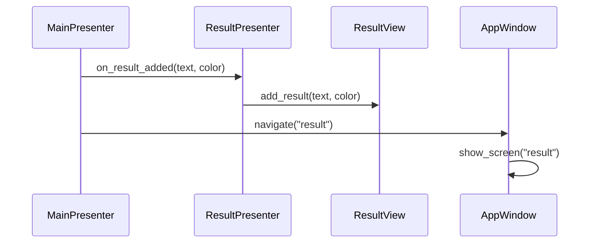
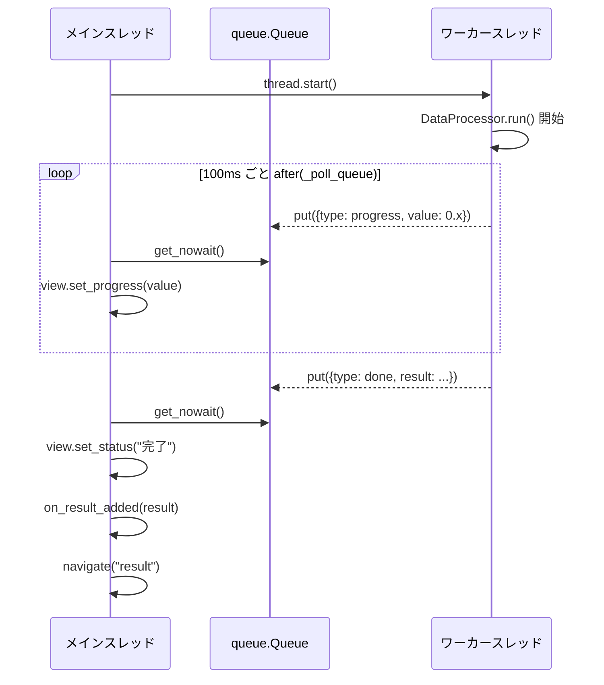

# pydesktop-mvp-template

CustomTkinter と **MVP (Model-View-Presenter)** パターンを使った、Pythonデスクトップ GUI アプリのテンプレートです。  
サイドバーナビゲーション付きの **3画面構成** で、機能追加時のディレクトリ分割の指針も示しています。

## 設計思想

チームメンバーのスキル差を吸収し、**学習コストとメンテナンスの難易度を下げる**ことを最優先としています。  
複雑な自作バインディング機構を避け、Python標準ライブラリ (`threading`, `queue`) のみで非同期処理を実現しています。

## 画面構成

| 画面 | 内容 |
|---|---|
| **メイン** | ファイル変換処理。完了後に自動で結果画面へ遷移 |
| **設定** | テーマ (light/dark/system) と処理ステップ数を JSON で永続保存 |
| **結果一覧** | 変換履歴をスクロール可能なリストで表示 |

## アーキテクチャ

```mermaid
flowchart TD
    main["main.py\nエントリーポイント / 全レイヤーの DI・起動"]

    subgraph views["views/"]
        MV["MainView\nCTkFrame"]
        SV["SettingsView\nCTkFrame"]
        RV["ResultView\nCTkFrame"]
    end

    subgraph presenters["presenters/"]
        MP["MainPresenter"]
        SP["SettingsPresenter"]
        RP["ResultPresenter"]
    end

    subgraph model["model/"]
        DP["DataProcessor\nprocessor.py"]
        CS["ConfigStore\nconfig_store.py"]
    end

    main -->|"生成・注入"| MV
    main -->|"生成・注入"| SV
    main -->|"生成・注入"| RV
    main -->|"生成・注入"| MP
    main -->|"生成・注入"| SP
    main -->|"生成・注入"| RP

    MV <-->|"callback"| MP
    SV <-->|"callback"| SP
    RV <-->|"callback"| RP

    MP -->|"run()"| DP
    MP -->|"load()"| CS
    SP -->|"load() / save()"| CS
```

### 画面間連携のフロー



### 非同期処理のフロー



## ディレクトリ構成

```
pydesktop-mvp-template/
├── .python-version
├── pyproject.toml
├── README.md
└── src/
    └── pydesktop_mvp/
        ├── __init__.py
        ├── main.py                      # DI・起動のみ
        ├── model/
        │   ├── __init__.py
        │   ├── processor.py             # データ変換 (UIを知らない)
        │   └── config_store.py          # 設定の永続化 (JSON)
        ├── views/
        │   ├── __init__.py
        │   ├── app_window.py            # ルートウィンドウ・サイドバー
        │   ├── main_view.py             # メイン画面 (Passive View)
        │   ├── settings_view.py         # 設定画面 (Passive View)
        │   └── result_view.py           # 結果一覧画面 (Passive View)
        └── presenters/
            ├── __init__.py
            ├── main_presenter.py        # 変換処理の指揮
            ├── settings_presenter.py    # 設定の読み書き
            └── result_presenter.py      # 結果の追加
```

## セットアップ & 起動

```bash
# 依存関係のインストール
uv sync

# アプリの起動
uv run pydesktop-mvp
```

## 設計ルール（変えてはいけないこと）

| ルール | 理由 |
|---|---|
| Model に tkinter/CTk を import しない | テスト可能性・再利用性の担保 |
| View はロジックを持たない (Passive View) | 責務の明確化 |
| Presenter 同士は直接呼ばない | 画面間連携は DI したコールバックで行う |
| スレッド間通信は queue のみ | シンプルさの維持 |

## 拡張方法

| 変更内容 | 編集するファイル |
|---|---|
| 重い処理の内容を変える | `model/processor.py` |
| 設定項目を増やす | `model/config_store.py` の `AppConfig` + `views/settings_view.py` + `presenters/settings_presenter.py` |
| 新しい画面を追加する | `views/` に新 View, `presenters/` に新 Presenter, `main.py` で DI |
| サイドバーの項目を増やす | `views/app_window.py` の `_NAV_ITEMS` |
